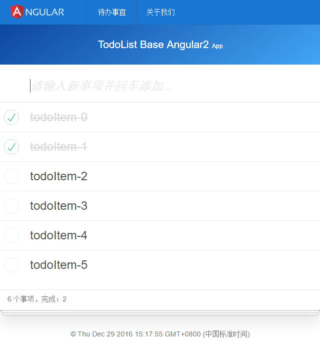

#preview


# angular2-base-start
A simple base project for Angular 2 apps, based on latest angular 2 version. Including lite server, file watch and reload.

The project is supposed to be used as a base project to learn angular2. Becasue there is no gulp or webpack to implement the tasks like minify and bundle js files, this repository should not be used in your product development.

##update 2017年1月5日20:39:54
add node service

## How to use.
Clone the repository, install the dependency and run:
```
git clone https://github.com/lamphc/angular2-base-start.git
cd angular2-base-start
npm install
node app
npm start
```
